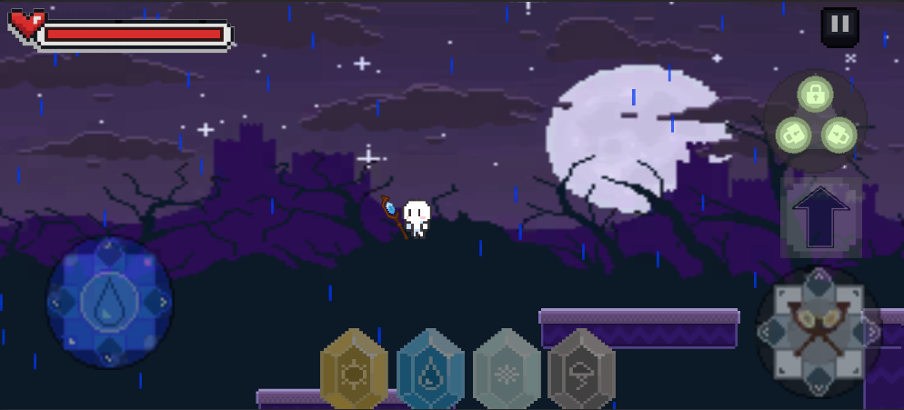
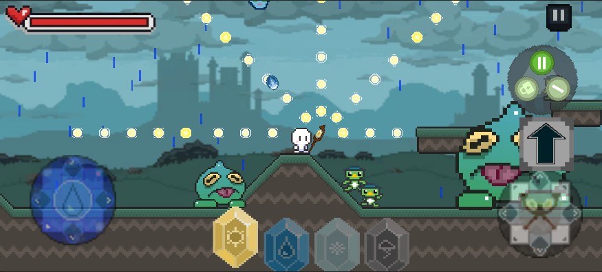

# EcoRift
 A group project for the Software Development Practice paper at AUT.

Group members:
- Kylie Crump
- Myles Hosken
- Christopher Young
- Jared Scholz

# Description
EcoRift is an Android 2D platform game that relies heavily on real time weather data. The player will navigate through multiple levels and battle enemies. Enemies are comprised of Sun, Rain, Storm and Snow. The in-game weather reflects the retrieved weather data at your location. Enemies are buffed and enhanced depending on their type and current weather state. Players can gain stronger attacks depending on their completed progress of the levels. 

## Technologies
Project is created with :
* Unity 2021.3.8f1
* Visual Studio 2019
* Open Weather API

## Setup
* google play place holder
* Please find the .apk file in the repo. This will only work on Android devices/emulators. Once you have the .apk file, feel free to install it to your device. If your device has a security block on unrecognized .apk files, you can bypass this depending on your Android version :
- Settings > Apps > Special app access > Install unknown apps
- Settings > Apps & notifications > Advanced > Special app access > Install unknown apps
- Settings > Apps and notifications
- Settings > Security
* If the above doesn't work, please follow : https://www.lifewire.com/install-apk-on-android-4177185

## Features
- On-screen joystick movement implemented for player control.
 
- Multiple enemies of different types, flying and ground.
 
- Player can shoot in any direction.
 
- Player can select and change from 4 different elemental weapons.
- 
- Weather dynamically controls the flow and feel of the game.
- Player can select from 4 different levels.
